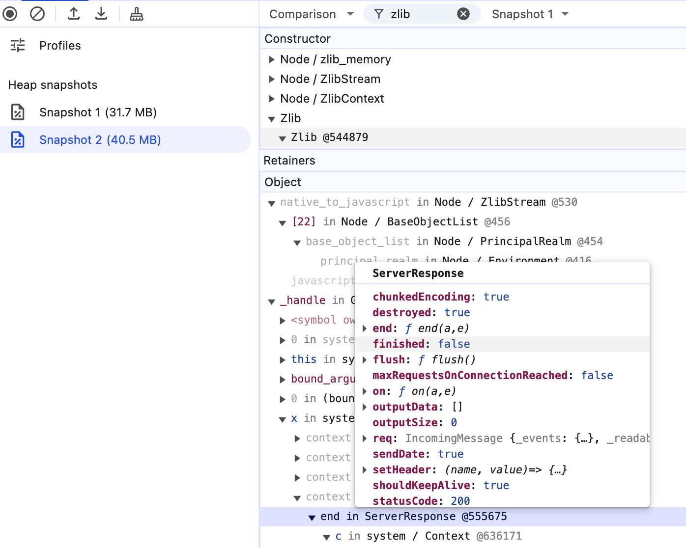

# Next.js Compression (zlib) Memory Leak

## Related Issues

- [vercel/next.js#89091](https://github.com/vercel/next.js/issues/89091) — zlib memory leak on Node.js 24
- [vercel/next.js@abfd994](https://github.com/vercel/next.js/commit/abfd99455120c5636238ddebb63636b19011e556) — fix attempt (did not resolve for this repro)

## Observation

When a client disconnects mid-stream (abort, navigation, timeout), `ServerResponse` instances remain reachable after the connection closes:

- `res.destroyed === true`
- `res.finished === false`

Heap snapshots show growing `Node / zlib_memory` retained through the `ServerResponse` → compression closure chain:



The retainer chain shows `ServerResponse` → compression listener/closure → zlib stream. As a control, a minimal `http.createServer` + `compression` server with the same abort pattern does **not** show the same memory growth. This suggests the issue is specific to Next.js's async request/render pipeline keeping `res` (and therefore the zlib stream) alive longer than expected after early disconnects.

This issue reproduces on **Node.js 24+**. On Node.js 23 and below, the leak does not manifest.

## To Reproduce

1. Use Node.js **24+**
2. `npm run build`
3. `npm start`
4. Follow http://localhost:3000/
5. Call GC & make memory snapshot
6. Run snippet in browser console:

```js
const ATTEMPT_COUNT = 50;
const ATTEMPT_TIMEOUT_MS = 10;
const REQUEST_COUNT = 10;
const REQUEST_TIMEOUT_MS = 500;

for await (const attemptIndex of Array.from({ length: ATTEMPT_COUNT }).keys()) {
  for (const requestIndex of Array.from({ length: REQUEST_COUNT }).keys()) {
    fetch('http://localhost:3000/', {
      signal: AbortSignal.timeout(REQUEST_TIMEOUT_MS),
    });
  }

  await new Promise((resolve) => {
    setTimeout(resolve, ATTEMPT_TIMEOUT_MS);
  });
}
```

7. Call GC & make memory snapshot
8. Compare snapshots and see `Node / zlib_memory` positive delta

If you disable compression in Next.js config with `compress: false`, the issue is gone.

## Workaround

Two patches applied via [`patch-package`](https://github.com/ds300/patch-package) (auto-applied on `npm install`):

### `patches/compression+1.8.1.patch`

Calls `stream.destroy()` on `res` `close` to break the retention chain at the stream level:

```javascript
_on.call(res, 'close', function onResponseClose() {
  if (stream && !stream.destroyed) {
    stream.destroy();
  }
});
```

### `patches/next+16.2.0-canary.33.patch`

Replaces `next/dist/compiled/compression` (minified) with the standalone `compression` package, so the above patch can be applied to readable source.

### Note

This mitigates the zlib memory growth by breaking the retention chain at the stream level, but does not address the underlying `res` reachability after early disconnects.

## Verify without workaround

```shell
npm install --ignore-scripts   # skip patch-package
npm run build
npm start
```

Then follow the reproduction steps above.
